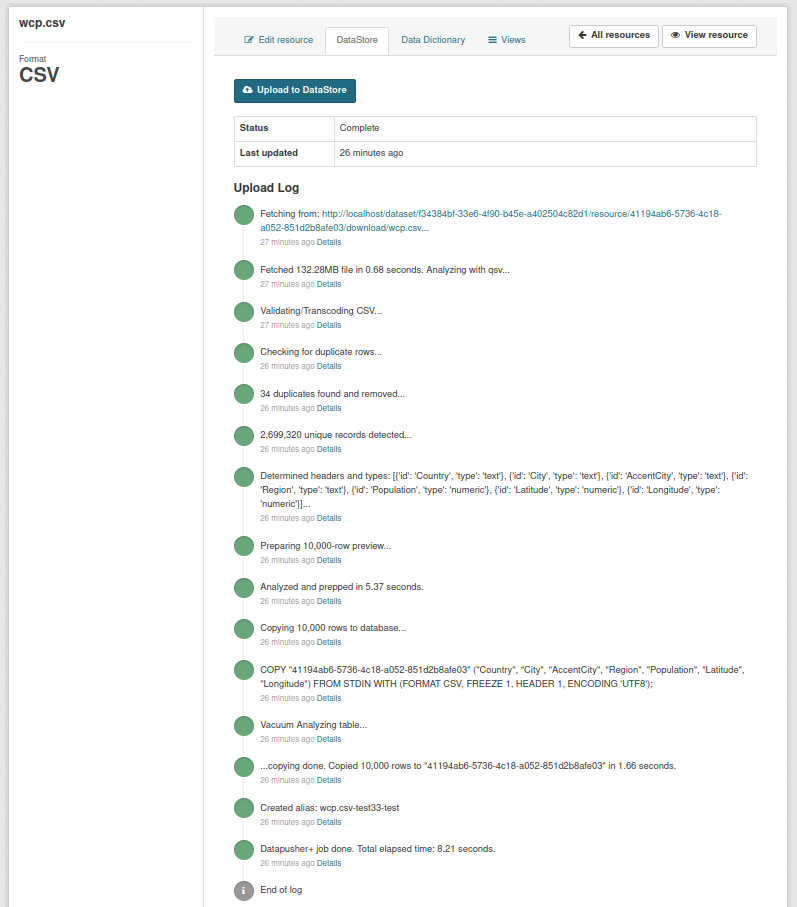
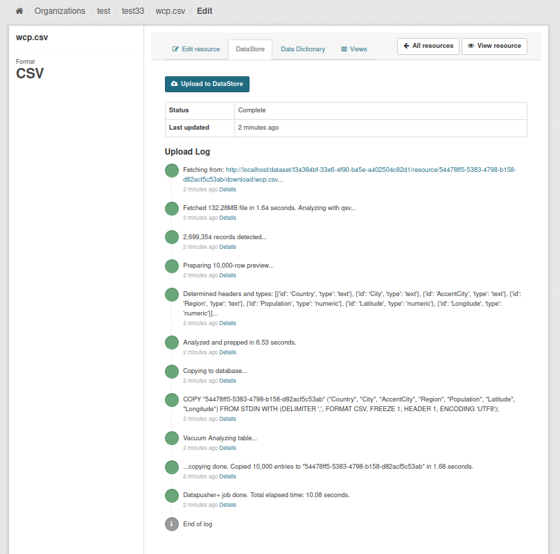

[CKAN Service Provider]: https://github.com/ckan/ckan-service-provider
[Messytables]: https://github.com/okfn/messytables
[qsv]: https://github.com/jqnatividad/qsv#qsv-ultra-fast-csv-data-wrangling-toolkit

# DataPusher+

DataPusher+ is a fork of [Datapusher](https://github.com/ckan/datapusher) that combines the speed and robustness of
[ckanext-xloader](https://github.com/ckan/ckanext-xloader) with the data type guessing of Datapusher.

Datapusher+ is built using [CKAN Service Provider][], with [Messytables] replaced by [qsv].

[TNRIS](https://tnris.org)/[TWDB](https://www.twdb.texas.gov/) provided the use cases that informed and supported the development
of Datapusher+, specifically, to support a [Resource-first upload workflow](docs/RESOURCE_FIRST_WORKFLOW.md#Resource-first-Upload-Workflow).

It features:

* **"Bullet-proof", ultra-fast data type inferencing with qsv**

  Unlike [Messytables][] which scans only the the first few rows to guess the type of
  a column, [qsv][] scans the entire table so its data type inferences are guaranteed[^1].

  Despite this, qsv is still exponentially faster even if it scans the whole file, not
  only inferring data types, it also calculates some descriptive statistics as well. For example,
  [scanning a 2.7 million row, 124MB CSV file for types and stats took 0.16 seconds](https://github.com/jqnatividad/qsv/blob/master/docs/whirlwind_tour.md#a-whirlwind-tour)[^2].

  It is very fast as qsv is written in [Rust](https://www.rust-lang.org/), is multithreaded,
  and uses all kinds of [performance techniques](https://github.com/jqnatividad/qsv/blob/master/docs/PERFORMANCE.md#performance-tuning)
  especially designed for data-wrangling.

* **Exponentially faster loading speed**

  Similar to xloader, we use PostgreSQL COPY to directly pipe the data into the datastore,
  short-circuiting the additional processing/transformation/API calls used by Datapusher.

  But unlike xloader, we load everything using the proper data types and not as text, so there's
  no need to reload the data again after adjusting the Data Dictionary, as you would with xloader.

* **Production-ready Robustness**

  In production, the number one source of support issues is Datapusher - primarily, because of
  data quality issues and Datapusher's inability to correctly infer data types, gracefully handle
  errors[^3], and provide the Data Publisher actionable information to correct the data.

  Datapusher+'s design directly addresses all these issues.

* **More informative datastore loading messages**

  Datapusher+ messages are designed to be more verbose and actionable, so the data publisher's
  user experience is far better and makes it possible to have a resource-first upload workflow.

* **Extended preprocessing with qsv**

  Apart from bullet-proof data type inferences, qsv is leveraged by Datapusher+ to convert Excel & ODS files;
  count the number of rows; transcode to UTF-8 if required; validate if a CSV conforms to the [RFC 4180 standard](https://datatracker.ietf.org/doc/html/rfc4180); sanitize header names so they are always valid Postgres column identifers;
  optionally create a preview subset and optionally deduplicate rows.

  Future versions of Datapusher+ will further leverage qsv's 80+ commands to do additional
  preprocessing, data-wrangling and validation. The Roadmap is available [here](https://github.com/dathere/datapusher-plus/issues/5).
  Ideas, suggestions and your feedback are most welcome!

[^1]: [Why use qsv instead of a "proper" python data analysis library like pandas?](https://github.com/dathere/datapusher-plus/discussions/15)
[^2]: It takes 0.16 seconds with an index to run `qsv stats` against the [qsv whirlwind tour sample file](https://raw.githubusercontent.com/wiki/jqnatividad/qsv/files/wcp.zip) on a Ryzen 4800H (8 physical/16 logical cores) with 32 gb memory and a 1 TB SSD.
Without an index, it takes 1.3 seconds.
[^3]: Imagine you have a 1M row CSV, and the last row has an invalid value for a numeric column (e.g. "N/A" instead of a number). 
      After spending hours pushing the data very slowly, legacy datapusher will abort on the last row and the ENTIRE job is invalid. 
      Ok, that's bad, but what makes it worse is that the old table has been deleted already, and Datapusher doesn't tell you what 
      caused the job to fail! YIKES!!!!


## Development installation

Datapusher+ is a drop-in replacement for Datapusher, so it's installed the same way.

Create a virtual environment for Datapusher+ using at least python 3.8:

    cd /usr/lib/ckan
    sudo python3.8 -m venv dpplus_venv
    sudo chown -R $(whoami) dpplus_venv
    . dpplus_venv/bin/activate
    cd dpplus_venv

> ℹ️ **NOTE:** DP+ requires at least python 3.8 as it makes extensive use of new capabilities introduced in 3.7/3.8
> to the [subprocess module](https://docs.python.org/3.8/library/subprocess.html).
> To install python 3.8 on Ubuntu, follow the procedure below:
> 
> ```
> sudo add-apt-repository ppa:deadsnakes/ppa
> # we use 3.8 here, but you can get a higher version by changing the version suffix of the packages below
> sudo apt install python3.8 python3.8-venv python3.8-dev
> # install additional dependencies
> sudo apt install build-essential libxslt1-dev libxml2-dev zlib1g-dev git libffi-dev
> ```
>
> Note that DP+ still works with CKAN<=2.8, which uses older versions of python.

Install the required packages:

    sudo apt-get install python-dev python-virtualenv build-essential libxslt1-dev libxml2-dev zlib1g-dev git libffi-dev

Get the code:

    git clone https://github.com/datHere/datapusher-plus
    cd datapusher-plus

Install the dependencies:

    pip install -r requirements-dev.txt
    pip install -e .

Install qsv:

[Download the appropriate precompiled binaries](https://github.com/jqnatividad/qsv/releases/latest) for your platform and copy
it to the appropriate directory, e.g. for Linux:

    wget https://github.com/jqnatividad/qsv/releases/download/0.81.0/qsv-0.81.0-x86_64-unknown-linux-gnu.zip
    unzip qsv-0.81.0-x86_64-unknown-linux-gnu.zip
    rm qsv-0.81.0-x86_64-unknown-linux-gnu.zip
    sudo mv qsv* /usr/local/bin

Alternatively, if you want to install qsv from source, follow
the instructions [here](https://github.com/jqnatividad/qsv#installation). Note that when compiling from source,
you may want to look into the [Performance Tuning](https://github.com/jqnatividad/qsv#performance-tuning)
section to squeeze even more performance from qsv.

Also, if you get glibc errors when starting qsv, your Linux distro may not have the required version of the GNU C Library.
In that case, use the `unknown-linux-musl.zip` archive as it is statically linked with the MUSL C Library.

If you already have qsv, update it to the latest release by using the --update option.

    qsvdp --update


> ℹ️ **NOTE:** qsv is a general purpose CSV data-wrangling toolkit that gets regular updates. To update to the latest version, just run
qsv with the `--update` option and it will check for the latest version and update as required.


Copy `datapusher/config.py` to a new file like `config_local.py` and modify your configuration as required.
Make sure to create the `datapusher` PostgreSQL user and the `datapusher_jobs` database (see [DataPusher+ Database Setup](#DataPusher+_Database_Setup)).

    cd datapusher
    cp config.py config_local.py
    # configure your installation as required
    nano config_local.py

    python3 datapusher/main.py datapusher/config_local.py

By default, DataPusher+ should be running at the following port:

    http://localhost:8800/

## Production deployment

### Manual installation

These instructions assume you already have CKAN installed on this server in the
default location described in the CKAN install documentation (`/usr/lib/ckan/default`). If this is the case,
you should be able to run the following commands directly, if not you will need to adapt the previous path to
your needs.

These instructions set up the DataPusher web service on
[uWSGI](https://uwsgi-docs.readthedocs.io/en/latest/) running on port 8800, but
can be easily adapted to other WSGI servers like Gunicorn. You'll probably need
to set up Nginx as a reverse proxy in front of it and something like Supervisor
to keep the process up.


    # Install requirements for DataPusher+. Be sure to have at least Python 3.8
    sudo apt install python3-venv python3-dev build-essential libxslt1-dev libxml2-dev libffi-dev

    cd /usr/lib/ckan

    # Create a virtualenv for DataPusher+. DP+ requires at least python 3.8.
    sudo python3.8 -m venv /usr/lib/ckan/dpplus_venv

    # Install qsv binary, if required
    wget https://github.com/jqnatividad/qsv/releases/download/0.81.0/qsv-0.81.0-x86_64-unknown-linux-gnu.zip
    unzip qsv-0.81.0-x86_64-unknown-linux-gnu.zip
    sudo mv qsv* /usr/local/bin
    rm qsv-0.81.0-x86_64-unknown-linux-gnu.zip

    # if qsv is already installed, be sure to update it to the latest release
    sudo qsvdp --update

    # ensure datapusher-plus and uwsgi are installed in the virtual environment
    cd /usr/lib/ckan/dpplus_venv/datapusher-plus
    pip install -e .
    pip install uwsgi

    # generate a settings file and tune it, as well as a uwsgi ini file
    sudo mkdir -p /etc/ckan/datapusher-plus
    sudo curl https://raw.githubusercontent.com/dathere/datapusher-plus/master/datapusher/settings.py -o /etc/ckan/datapusher-plus/settings.py
    sudo curl https://raw.githubusercontent.com/dathere/datapusher-plus/master/deployment/datapusher-uwsgi.ini -o /etc/ckan/datapusher-plus/uwsgi.ini

    # Be sure to initialize the database if required. (See Database Setup section below)
    # Be sure to the .env and settings.py files have the right connect strings!

    # Create a user to run the web service (if necessary)
    sudo addgroup www-data
    sudo adduser -G www-data www-data

At this point you can run DataPusher+ with the following command:

    /usr/lib/ckan/dpplus_venv/bin/uwsgi --enable-threads -i /etc/ckan/datapusher-plus/uwsgi.ini

You might need to change the `uid` and `guid` in the `uwsgi.ini` file when using a different user.

To deploy it using supervisor:

    sudo curl https://raw.githubusercontent.com/dathere/datapusher-plus/master/deployment/datapusher-uwsgi.conf -o /etc/supervisor/conf.d/datapusher-uwsgi.conf
    sudo service supervisor restart

### Package deployment (WIP)
As Datapusher+ is quite involved as evinced by the above procedure, a containerized package installation 
will make it far easier not only to deploy DP+ to production, but also to experiment with.

The upcoming DP+ package will also expose additional features and administrative interface to manage
not only Datapusher+ jobs, but also to manage the CKAN Datastore.


## Configuring


### CKAN Configuration

Add `datapusher` to the plugins in your CKAN configuration file
(generally located at `/etc/ckan/default/ckan.ini`):

    ckan.plugins = <other plugins> datapusher

In order to tell CKAN where this webservice is located, the following must be
added to the `[app:main]` section of your CKAN configuration file :

    ckan.datapusher.url = http://127.0.0.1:8800/

There are other CKAN configuration options that allow to customize the CKAN - DataPusher
integration. Please refer to the [DataPusher Settings](https://docs.ckan.org/en/latest/maintaining/configuration.html#datapusher-settings) section in the CKAN documentation for more details.

> ℹ️ **NOTE:** DP+ recognizes some additional TSV and spreadsheet subformats - `xlsm` and `xlsb` for Excel Spreadsheets,
> and `tab` for TSV files. To process these subformats, set `ckan.datapusher.formats` as follows in your CKAN.INI file:
>
>```
> ckan.datapusher.formats = csv xls xlsx xlsm xlsb tsv tab application/csv application/vnd.ms-excel application/vnd.openxmlformats-officedocument.spreadsheetml.sheet ods application/vnd.oasis.opendocument.spreadsheet
>```
>
>and add this entry to your CKAN's `resource_formats.json` file.
>
>```
> ["TAB", "Tab Separated Values File", "text/tab-separated-values", []],
>```


### DataPusher+ Configuration

The DataPusher+ instance is configured in the `config_local.py`
file. The location of this file can be adjusted using the `JOB_CONFIG`
environment variable which should provide an absolute path to a python-formatted
config file.

Here's a summary of the options available.

| Name | Default | Description |
| -- | -- | -- |
| HOST | '0.0.0.0' | Web server host |
| PORT | 8800 | Web server port |
| SQLALCHEMY_DATABASE_URI | 'postgresql://datapusher_jobs:<br/>YOURPASSWORD<br/>@localhost/datapusher_jobs' | SQLAlchemy Database URL. See note below about setting up the `datapusher_jobs` db beforehand. |
| MAX_CONTENT_LENGTH | '1024000' | Max size of files to process in bytes |
| CHUNK_SIZE | '16384' | Chunk size when processing the data file |
| DOWNLOAD_TIMEOUT | '30' | Download timeout for requesting the file |
| SSL_VERIFY | False | Do not validate SSL certificates when requesting the data file (*Warning*: Do not use this setting in production) |
| TYPES | 'String', 'Float', 'Integer', 'DateTime', 'Date', 'NULL' | These are the types that qsv can infer. |
| TYPE_MAPPING | {'String': 'text', 'Integer': 'numeric', 'Float': 'numeric', 'DateTime': 'timestamp', 'Date': 'timestamp', 'NULL': 'text'} | Internal qsv type mapping to PostgreSQL types |
| LOG_FILE | `/tmp/ckan_service.log` | Where to write the logs. Use an empty string to disable |
| STDERR | `True` | Log to stderr? |
| QSV_BIN | /usr/local/bin/qsvdp | The location of the qsv binary to use. qsvdp is the DP+ optimized version of qsv. It only has the commands used by DP+, has the self-update engine removed, and is 6x smaller than qsv and 3x smaller than qsvlite. You may also want to look into using `qsvdp_nightly`, for even more performance. |
| PREVIEW_ROWS | 1000 | The number of rows to insert to the data store. Set to 0 to insert all rows |
| QSV_DEDUP | `True` | Automatically deduplicate rows? |
| DEFAULT_EXCEL_SHEET | 0 | The zero-based index of the Excel sheet to export to CSV and insert into the Datastore. Negative values are accepted, i.e. -1 is the last sheet, -2 is 2nd to the last, etc. |
| AUTO_ALIAS | `True` | Automatically create a resource alias - RESOURCE_NAME-PACKAGE_NAME-OWNER_ORG, that's easier to use in API calls and with the scheming datastore_choices helper |
| WRITE_ENGINE_URL | | The Postgres connection string to use to write to the Datastore using Postgres COPY. This should be **similar** to your `ckan.datastore.write_url`, except you'll need to use the `datapusher` user |

All of the configuration options above can be also provided as environment
variables, which can be set by setting key-value pairs in a `.env` file. For variables with boolean values you must use `1` or `0`.

### DataPusher+ Database Setup

DP+ requires a dedicated PostgreSQL account named `datapusher` to connect to the CKAN Datastore.

To create the `datapusher` user and give it the required privileges to the `datastore_default` database:

```
su - postgres
psql -d datastore_default
CREATE ROLE datapusher LOGIN PASSWORD 'YOURPASSWORD';
GRANT CREATE, CONNECT, TEMPORARY ON DATABASE datastore_default TO datapusher;
GRANT SELECT, INSERT, UPDATE, DELETE, TRUNCATE ON ALL TABLES IN SCHEMA public TO datapusher;
\q
```

DP+ also requires its own job_store database to keep track of all the DP+ jobs. In the original Datapusher,
this was a sqlite database by default. Though DP+ can still use a sqlite database, we are discouraging its use.

To setup the `datapusher_jobs` database and its user:

    sudo -u postgres createuser -S -D -R -P datapusher_jobs
    sudo -u postgres createdb -O datapusher_jobs datapusher_jobs -E utf-8

## Usage

Any file that has one of the supported formats (defined in [`ckan.datapusher.formats`](https://docs.ckan.org/en/latest/maintaining/configuration.html#ckan-datapusher-formats)) will be attempted to be loaded
into the DataStore.

You can also manually trigger resources to be resubmitted. When editing a resource in CKAN (clicking the "Manage" button on a resource page), a new tab named "DataStore" will appear. This will contain a log of the last attempted upload and a button to retry the upload.




### Command line

Run the following command to submit all resources to datapusher, although it will skip files whose hash of the data file has not changed:

    ckan -c /etc/ckan/default/ckan.ini datapusher resubmit

On CKAN<=2.8:

    paster --plugin=ckan datapusher resubmit -c /etc/ckan/default/ckan.ini

To Resubmit a specific resource, whether or not the hash of the data file has changed::

    ckan -c /etc/ckan/default/ckan.ini datapusher submit {dataset_id}

On CKAN<=2.8:

    paster --plugin=ckan datapusher submit <pkgname> -c /etc/ckan/default/ckan.ini


## License

This material is copyright (c) 2020 Open Knowledge Foundation and other contributors

It is open and licensed under the GNU Affero General Public License (AGPL) v3.0
whose full text may be found at:

http://www.fsf.org/licensing/licenses/agpl-3.0.html
